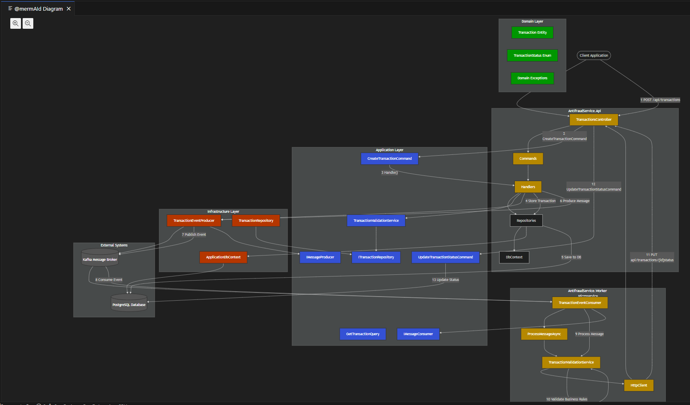

# Technical Challenge - HENRY CANGALAYA

# Servicio Antifraude

## Descripción general
El Servicio Antifraude es un microservicio diseñado para validar transacciones financieras y actualizar su estado basado en criterios predefinidos. Utiliza una arquitectura hexagonal para asegurar la separación de responsabilidades y mantenibilidad. El servicio se comunica con otros componentes a través de Kafka para mensajería y utiliza una base de datos para el almacenamiento de transacciones.

## Funcionalidades
- **Creación de Transacciones**: Permite la creación de transacciones financieras con un estado inicial de "pendiente".
- **Validación de Transacciones**: Valida las transacciones basándose en los siguientes criterios:
  - Las transacciones con un valor mayor a 2000 son automáticamente rechazadas.
  - El valor acumulado de transacciones diarias no debe exceder 20000.
- **Actualización de Estado de Transacciones**: Actualiza el estado de las transacciones según los resultados de la validación, enviando mensajes de vuelta al creador de la transacción.

## Arquitectura
El proyecto sigue una arquitectura hexagonal, que consiste en las siguientes capas:
- **Capa de Dominio**: Contiene la lógica central del negocio, incluyendo entidades, objetos de valor y excepciones de dominio.
- **Capa de Aplicación**: Gestiona la lógica de aplicación, incluyendo comandos, consultas y servicios para la validación de transacciones.
- **Capa de Infraestructura**: Maneja el acceso a datos, mensajería y dependencias externas.
- **Capa de API**: Expone endpoints HTTP para operaciones de transacciones.
- **Worker Service**: Procesa mensajes de Kafka y realiza validaciones en segundo plano.

## Componentes del Sistema

### API
La API REST expone endpoints para crear y consultar transacciones. Cuando se crea una transacción, se guarda en la base de datos y se envía un mensaje a Kafka para su validación asíncrona.

### Worker
El Worker es un servicio en segundo plano que:
- Consume mensajes del topic "transaction-events" en Kafka
- Procesa cada transacción aplicando las reglas de validación definidas
- Actualiza el estado de la transacción en la base de datos (Approved/Rejected)
- Notifica los resultados de validación a través de la API

## Stack Tecnológico
- **.NET 8**: El framework principal para construir el microservicio.
- **Entity Framework Core**: Para interacciones con la base de datos.
- **Kafka**: Para mensajería entre servicios.
- **PostgreSQL**: Como base de datos para almacenar datos de transacciones.

## Primeros pasos
1. **Clonar el Repositorio**: 
   ```bash
   git clone <repository-url>
   cd AntifraudService
   ```

2. **Construir la Solución**: 
   ```bash
   dotnet build AntifraudService.sln
   ```

3. **Ejecutar la Aplicación con Visual Studio Code**: La aplicacion necesita que se ejecuten el API y el Worker al mismo tiempo.
- Terminal 1 - Iniciar la API:
   ```bash
   cd src/AntifraudService.Api
   dotnet run
   ```
- Terminal 2 - Iniciar el Worker:
   ```bash
   cd src/AntifraudService.Worker
   dotnet run
   ```

4. **Ejecutar la Aplicación con Visual Studio Community**:
La aplicación requiere que la API y el Worker se ejecuten simultáneamente.
   1. Haga clic derecho en la solución en el Explorador de soluciones y seleccione **Propiedades**
   2. En la ventana de propiedades, seleccione **Proyecto de inicio múltiple** en la sección de propiedades comunes
   3. Configure los siguientes proyectos como "Iniciar":
      - `AntifraudService.Api`
      - `AntifraudService.Worker`
   4. Haga clic en **Aplicar** y luego **Aceptar** para guardar la configuración
   5. Presione **F5** o haga clic en el botón "Iniciar" para ejecutar la aplicación
   6. Se abrirán dos ventanas de consola:
      - Una mostrando los logs de la API
      - Otra mostrando los logs del Worker

**Nota**: Para la ejecución local con vscode o visual studio community, asegúrate de tener PostgreSQL y Kafka ejecutándose localmente o modifica los archivos appsettings.Development.json para apuntar a tus servicios.

4. **Acceder a la API**: La API estará disponible en `http://localhost:58809/swagger`.

## Ejecutando Docker Compose
Para un despliegue completo utilizando Docker Compose, sigue estos pasos:

1. **Construir las imágenes**
   ```bash
   docker-compose build
   ```
Este comando construirá todas las imágenes definidas en el archivo docker-compose.yaml, incluyendo API y Worker.

2. **Iniciar los servicios**
   ```bash
   docker-compose up -d
   ```
La opción `-d` ejecuta los contenedores en segundo plano. Omítela si deseas ver los logs en tiempo real.

3. **Esperar a que se completen los healthchecks**: Los servicios están configurados con healthchecks para asegurar que se inicien en el orden correcto:
- PostgreSQL se inicia primero
- Kafka espera a que ZooKeeper esté disponible
- API espera a que PostgreSQL esté saludable
- Worker espera a que todos los servicios estén listos
Este proceso puede tomar hasta 30 segundos dependiendo del sistema.

4. **Verificar el estado de los contenedores:**
   ```bash
   docker-compose ps
   ```
Este comando muestra todos los contenedores en ejecución y su estado. Todos deberían mostrar el estado "Up".

5. **Ver logs de servicios específicos** (opcional):
   ```bash
   docker-compose logs api
   docker-compose logs worker
   ```

6. **Detener y eliminar todos los contenedores:**
   ```bash
   docker-compose down
   ```
Para eliminar también los volúmenes (y perder datos persistentes):
   ```bash
   docker-compose down -v
   ```

## Swagger UI
La API incluye documentación interactiva a través de Swagger UI, que permite explorar y probar los endpoints disponibles.

**Acceso a Swagger**
- **Ejecución local (desde IDE)**: https://localhost:58810/swagger
- **Ejecución con docker-compose**: http://localhost:58809/swagger

## Uso de Swagger

1. Navega a la URL de Swagger correspondiente según tu entorno
2. Explora los endpoints disponibles en la interfaz
3. Haz clic en un endpoint para expandir sus detalles
4. Utiliza el botón "Try it out" para ejecutar solicitudes de prueba

## Endpoints
- **Crear Transacción:**
  - **POST** `/api/transactions`
  - Request Body:
    ```json
    {
      "sourceAccountId": "38494e72-670c-4edc-a48f-cc389d047999",
      "targetAccountId": "45678e72-670c-4edc-a48f-cc389d047888",
      "transferTypeId": 1,
      "value": 120
    }
    ```
- **Obtener Transacción:**
  - **GET** `/api/transactions/{transactionExternalId}`

## Uso con Postman
**Crear una Transacción (POST)**
1. URL: `http://localhost:58809/api/transactions` (Docker) o `https://localhost:58810/api/transactions` (Local)
2. Método: POST
3. Headers: `Content-Type: application/json`
4. Body:
    ```json
    {
      "sourceAccountId": "38494e72-670c-4edc-a48f-cc389d047999",
      "targetAccountId": "45678e72-670c-4edc-a48f-cc389d047888",
      "transferTypeId": 1,
      "value": 120
    }
    ```
5. El servicio responderá con el ID de la transacción creada y estado inicial "Pending"

**Consultar una Transacción (GET)**
1. URL: `http://localhost:58809/api/transactions/{transactionId}` (Docker) o `https://localhost:58810/api/transactions/{transactionId}` (Local)
  - Reemplaza `{transactionId}` con el ID obtenido en el paso anterior
2. Método: GET
3. Después de unos segundos, el worker debería haber procesado la transacción y su estado será "Approved" o "Rejected"

## Arquitectura de la aplicación
El diagrama de la arquitectura de la los microservicios se encuentra en formato mmd, para visualizarse se puede usar una herramienta en línea como `https://mermaid.live/edit`, o también se puede instalar una extensión en visual studio code como `Mermaid Preview`ó `vscode-mermAId`
